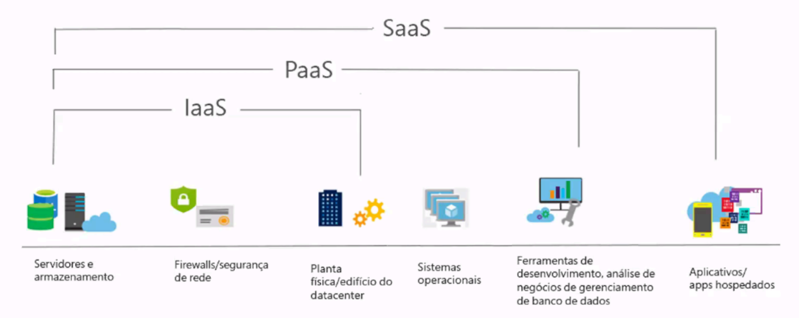

# 1.2 - Descrever os benefícios e tipos de serviço de nuvem

## Benefícios da nuvem

- **Alta disponibilidade**: Serviços disponíveis 24/7 com redundância integrada.
- **Escalabilidade**: Ajuste automático de recursos conforme a demanda.
- **Elasticidade**: Capacidade de aumentar ou reduzir recursos rapidamente.
- **Agilidade**: Implantação rápida de soluções.
- **Economia**: Pague apenas pelo que usar.
- **Segurança**: Proteções integradas e conformidade com padrões globais.

## Tipos de serviço de nuvem

IaaS, PaaS e SaaS são modelos de serviços baseados na computação em nuvem, que permitem que você acesse recursos de TI pela internet, sem precisar manter uma infraestrutura
própria. A diferença entre eles é o nível de responsabilidade e controle que você tem sobre esses recursos.

- **IaaS (Infraestrutura como Serviço)**: Acesso a recursos de computação básicos como máquinas virtuais, redes e armazenamento. Você contrata servidores, armazenamento, rede e outros recursos de TI de um provedor de nuvem, mas é responsável por gerenciar o sistema operacional, o middleware e as aplicações que rodam nesses recursos. Você tem mais flexibilidade e controle, mas também mais trabalho.

- **PaaS (Plataforma como Serviço)**: Ambiente para desenvolvimento, teste e implantação de aplicativos sem gerenciar infraestrutura. Você contrata uma plataforma de desenvolvimento e execução de aplicações de um provedor de nuvem, mas é responsável por gerenciar o código e os dados das suas aplicações. Você tem mais facilidade e produtividade, mas
também menos personalização. 

- **SaaS (Software como Serviço)**: Aplicativos prontos para uso, acessíveis pela internet, como e-mail ou CRM.Você contrata um software pronto e hospedado de um provedor de nuvem, mas é responsável apenas por usar e configurar o software de acordo com as suas necessidades. Você tem mais praticidade e economia, mas também menos autonomia. 

<h3 align="center">Comparação do serviço de nuvem</h3>

  <table>
    <thead>
      <tr>
        <th>IAAS</th>
        <th>PAAS</th>
        <th>SAAS</th>
      </tr>
    </thead>
    <tbody>
      <tr>
        <td>O serviço de nuvem mais flexível.</td>
        <td>Focado no desenvolvimento de aplicativos.</td>
        <td>Modelo de preço pago conforme o uso.</td>
      </tr>
      <tr>
        <td>Você configura e gerencia o hardware para seu aplicativo.</td>
        <td>O gerenciamento de plataforma é realizado pelo provedor de nuvem.</td>
        <td>Os usuários pagam pelo software que utilizam em um modelo de assinatura.</td>
      </tr>
    </tbody>
  </table>

## Casos de uso

- IaaS: Migração de servidores locais para a nuvem. Exemplos: Amazon Web Services, Microsoft Azure, Google Cloud Platform.
- PaaS: Desenvolvimento de aplicativos web. Exemplos: Heroku, OpenShift, Firebase.
- SaaS: Uso de ferramentas como Microsoft 365 ou Salesforce. Exemplos: Gmail, Netflix, Spotify.

  

## Avaliação do módulo

1. Qual tipo de expansão envolve adicionar ou remover recursos (como máquinas virtuais ou contêineres) para atender à demanda?
    - [ ] Dimensionamento vertical.
    - [ ] Dimensionamento horizontal. ✅
    - [ ] Escala direta.

2. O que é caracterizado como a capacidade de um sistema de se recuperar de falhas e continuar funcionando?
    - [ ] Confiabilidade. ✅
    - [ ] Previsibilidade.
    - [ ] Escalabilidade. 

## Referências
[Descrever os benefícios do uso de serviços de nuvem](https://learn.microsoft.com/pt-br/training/modules/describe-benefits-use-cloud-services/)
